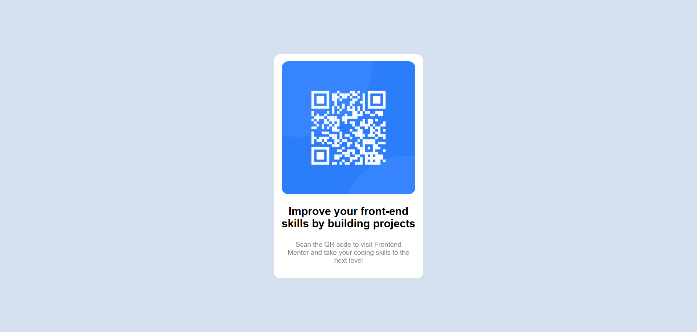

# Frontend Mentor - QR code component solution

This is a solution to the [QR code component challenge on Frontend Mentor](https://www.frontendmentor.io/challenges/qr-code-component-iux_sIO_H). Frontend Mentor challenges help you improve your coding skills by building realistic projects.

## Table of contents

- [Overview](#overview)
  - [Screenshot](#screenshot)
  - [Links](#links)
- [My process](#my-process)
  - [Built with](#built-with)
  - [What I learned](#what-i-learned)
  - [Continued development](#continued-development)
  - [Useful resources](#useful-resources)
- [Author](#author)
- [Acknowledgments](#acknowledgments)

## Overview

### Screenshot

### Links

- Solution URL: [Solution URL](https://github.com/hazhir00/QR-Code-Component.git)
- Live Site URL: [Live Site URL](https://qr-code-component-frontend-mentor001.netlify.app/)

## My process

### Built with

- Semantic HTML5 markup
- CSS custom properties
- Flexbox
- Mobile-first workflow

### What I learned

- Using Google Fonts
- Flexbox

### Continued development

- Responsive Design

### Useful resources

- [Github Tutorial](https://www.youtube.com/watch?v=8Dd7KRpKeaE)
- [Markdown Tutorial](https://www.youtube.com/watch?v=HUBNt18RFbo)

## Author

- Linkedin - [Hazhir Naseri](www.linkedin.com/in/hazhir-naseri-610091186)
- Frontend Mentor - [@hazhir00](https://www.frontendmentor.io/profile/hazhir00)
- Github - [@hazhir00](https://github.com/hazhir00)

## Acknowledgments

A heartfelt thank you to everyone who contributed free educational resources. Your efforts are truly respected.
